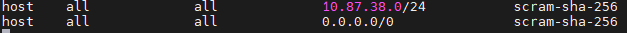
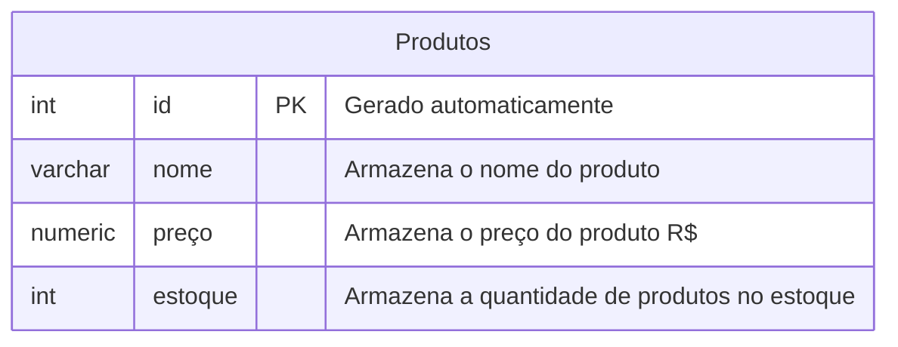

#### Aletrações nos parâmetros dos arquivos de configuração
1. Navegamos até o caminho:
```bash
cd /etc/postgresql/18/main
```
2. Alteração no arquivo pg_hba.conf:
```bash
sudo nano pg_hba.conf
```

=> 10.87.38.2/32 -> habilita apenas um endereço IP

=> 0.0.0.0/0 -> habilita qualquer IP

---
Para excluir um banco de dados, utilizamos o comando:
```sql
DROP DATABASE cidades;
```
>Cuidado na operação! uma vez apagado, não terá mais acesso à esse banco de dados.

---

Primeiro, iniciamos o processo criando um banco de dados:
```sql
CREATE DATABASE uribemarket;
```
Para acessar o PostgresSQL Explorer:
- IP do meu servidor;
- Postgres;
- Senha;
- Clicar em Standart;
- Selecionar seu Banco de dados.

---
**Modelando o primeiro banco de dados**

Para crição do banco de dados, utilizamos os seguintes comandos:

```sql
CREATE TABLE produtos (
    id INT GENERATED ALWAYS AS IDENTITY PRIMARY KEY NOT NULL,
    nome VARCHAR(50) NOT NULL,
    preço NUMERIC(10,2) NOT NULL,
    estoque INT NOT NULL DEFAULT 0
);
```
`"F5"` pra executar.

>Comando de verificação:
```sql
SELECT * FROM produtos;
```
>Comando para inserir produtos na tabela:
```sql
 INSERT INTO produtos(nome,preço,estoque)
 VALUES('Chuveiro','100','20');
 ```