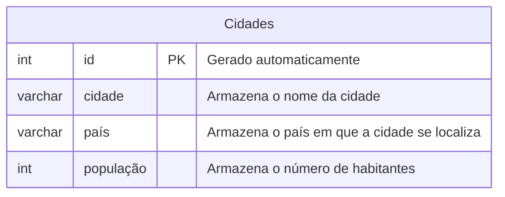

### Etapas do processo para criação do Banco de Dados Cidades:

Para criação do banco de dados, utilizamos os seguintes comandos:
---
**Modelando o primeiro banco de dados**

---
Para criação da tabela, utilizamos os seguintes comandos: 

>Cria a tabela com as respectivas colunas:
```sql
CREATE TABLE cidades (
    id INT GENERATED ALWAYS AS IDENTITY PRIMARY KEY NOT NULL,
    cidade VARCHAR(50) NOT NULL,
    país VARCHAR(50) NOT NULL,
    população INT NOT NULL DEFAULT 0
);
```
`"F5"` pra executar.

--- 

>Comando de verificação:
```sql
SELECT * FROM cidades;
```

--- 

>Comando para inserir cidades na tabela:
```sql
 INSERT INTO cidades (cidade, país, população)
 VALUES 
    ('Nova York', 'Estados Unidos', 8336817),
    ('Tóquio', 'Japão', 13960000),
    ('Los Angeles', 'Estados Unidos', 3822238),
    ('Londres', 'Reino Unido', 8982000),
    ('Paris', 'França', 2161000),
    ('Pequim', 'China', 21893095),
    ('Xangai', 'China', 24870895),
    ('Chicago', 'Estados Unidos', 2665039),
    ('Cingapura', 'Cingapura', 5637000),
    ('Shenzhen', 'China', 12590000);
 ```
 
--- 

>Consulta simples para listar todas as cidades cadastradas:

```sql
SELECT * FROM cidades;
```

--- 

>Consulta ordenada mostrando as cidades por ordem de população (da maior para a menor):

```sql
SELECT id, cidade, país, população FROM cidades
ORDER BY população DESC;
```