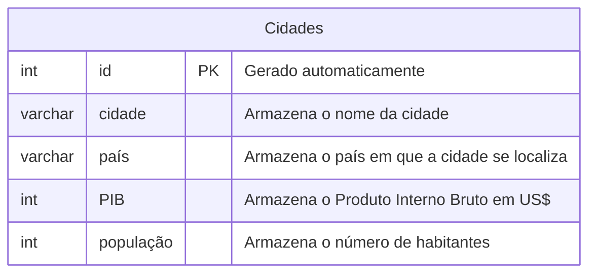

### Etapas do processo para criação do Banco de Dados Cidades:

Para criação do banco de dados, utilizamos os seguintes comandos:
---
**Modelando o primeiro banco de dados**

---
Para criação da tabela, utilizamos os seguintes comandos: 

>Cria a tabela com as respectivas colunas:
```sql
CREATE TABLE cidades (
    id INT GENERATED ALWAYS AS IDENTITY PRIMARY KEY NOT NULL,
    cidade VARCHAR(50) NOT NULL,
    país VARCHAR(50) NOT NULL,
    população INT NOT NULL DEFAULT 0
);
```
`"F5"` pra executar.

>Comando de verificação:
```sql
SELECT * FROM cidades;
```
>Comando para inserir cidades na tabela:
```sql
 INSERT INTO cidades (cidade, país, população)
 VALUES('','','');
 ```