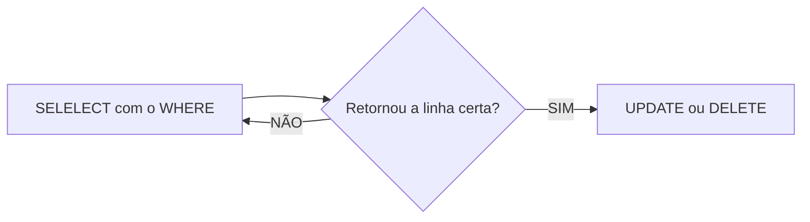

## Update e Delete
**UPDATE** ou **DELETE** afetam todas as linhas da sua tabela. Logo, **JAMAIS** executar sem o comando `WHERE`.

```mermaid
flowchart LR
A[SELELECT com o WHERE] -->B{Retornou a linha certa?}
B--SIM-->C[UPDATE ou DELETE]
B--NÃO-->A

```