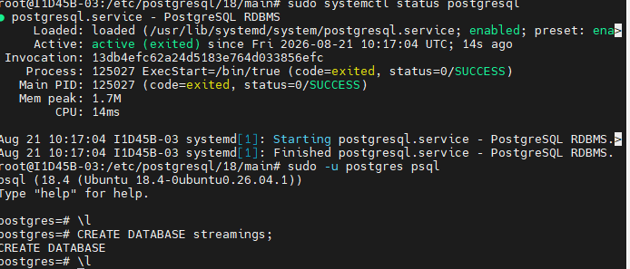
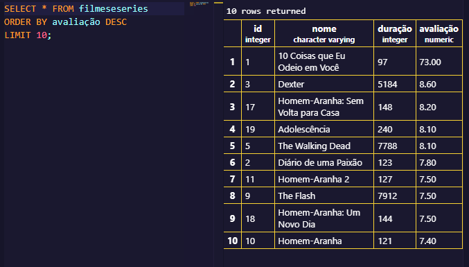

### Criação do banco de dados - streaming
Para a criação do banco de dados Utiizei os seguintes comandos: `sudo -u postgres psql`para acessar o postgres. Em seguida `CREATE DATABASE streaming` para criar o banco de dados.


## Criação da tabela:

```sql
CREATE TABLE titulos (
id INT GENERATED ALWAYS AS IDENTITY PRIMARY KEY NOT NULL,
nome VARCHAR(50) NOT NULL,
duração INT NOT NULL,
avaliação DECIMAL(3,1) NOT NULL,
);
```

## Adicionar 20 registros (filmes e séries):
```sql
INSERT INTO filmeseseries(nome, duração, avaliação)
VALUES('10 Coisas que Eu Odeio em Você', '97', '7.3'),
('Diário de uma Paixão', '123', '7.8'),
('Dexter', '5184', '8.6'),
('Manifest', '2666', '7.1'),
('The Walking Dead', '7788', '8.1'),
('Maze Runner: Correr ou Morrer', '113', '6.8'),
('Maze Runner: Prova de Fogo', '131', '6.3'),
('Maze Runner: A Cura Mortal', '142', '6.3'),
('The Flash', '7912', '7.5'),
('Homem-Aranha', '121', '7.4'),
('Homem-Aranha 2', '127', '7.5'),
('Homem-Aranha 3', '139', '6.3'),
('O Espetacular Homem-Aranha', '136', '6.9'),
('O Espetacular Homem-Aranha 2: A Ameaça de Electro', '142', '6.6'),
('Homem-Aranha: De Volta ao Lar', '133', '7.4'),
('Homem-Aranha: Longe de Casa', '129', '7.4'),
('Homem-Aranha: Sem Volta para Casa', '148', '8.2'),
('Homem-Aranha: Um Novo Dia', '144', '7.5'),
('Adolescência', '240', '8.1'),
('Eu Vou Te Encontrar', '360', '7.1');
 ```

 ## Para Exibir os 10 filmes melhores avaliados:
```sql
SELECT * FROM filmeseseries
ORDER BY avaliação DESC
LIMIT 10;
```
 

## Para atualizar algumas notas:
```sql
UPDATE filmeseseries
SET avaliação = '9.0' 
WHERE nome = 'Dexter';

UPDATE filmeseseries 
SET avaliação = '8.3' 
WHERE nome = 'Manifest';

UPDATE filmeseseries 
SET avaliação = '8.5' 
WHERE nome = 'Eu Vou Te Encontrar';

```

## Para apagar 5 registros:
```sql
DELETE FROM filmeseseries
WHERE nome IN (
    'Maze Runner: A Cura Mortal',
    'Homem-Aranha 3',
    'O Espetacular Homem-Aranha 2: A Ameaça de Electro',
    'Diário de uma Paixão',
    'Adolescência'
);
```
5 LINHAS APAGADAS


**OBS:** *Para melhorar nas proximas atividades:* Sempre que colocar um comando novo no sql, ja passar nas anotações, para se caso precise terminar em outro momento, não perder todo o progresso (mesmo que a tabela em si fique salva)